<h4 align="center"> 
	🚧 React Router 🚀
</h4>   

 
   

 

## 🎨 Projeto

Construindo um projeto com diversos partes de outras atividades

## 💻 Tarefas

- [x] 1. reunir um a um
- [ ] 2. revisar o css para não dar conflito com os nomes de classes

<h4 align="center"> 
	🚧 React Router 🚀
</h4>   

 
   

 

## 🎨 Projeto

- Criado um layout para demonstrar os fundamentos do react router na prática.

## 💻 Tarefas

- [x] 1. Instalação de dependências: `npm i -g create-react-app`
- [x] 2. Criação de Projeto: `npx create-react-app react-router` e `npm i react-router-dom`
- [x] 3. Estrutura de Projeto: src, components, views
- [x] 4. Aplicação de estilo
- [x] 5. Navegação simples
- [x] 6. Navegação com Parâmetro
- [x] 7. Parâmetro exact
- [x] 8. Página não encontrada
- [x] 9. Detalhes finais do módulo

## 🚀 Seções 

- [x] Layout e lógica [50 - 59] 

## 🚀 Construído o projeto 

- favicon navegação
- título da página
- idioma da página
- fonts google roboto via link
- navegação em react com [react router](https://reactrouter.com/en/main) 

## 🚀 Referências 

-[warning error](https://stackoverflow.com/questions/69692842/error-message-error0308010cdigital-envelope-routinesunsupported)

## 📝 Licença

Este projeto esta sobe a licença MIT.

Feito com ❤️ por Douglas A B Novato 👋🏽 [Entre em contato!](https://www.linkedin.com/in/douglasabnovato/)
 
Fonte do projeto Por Leonardo Moura Leitão no [Curso React + Redux: Fundamentos e 2 Apps do Absoluto ZERO!](https://www.udemy.com/course/react-redux-pt/), [Cod3r](https://www.cod3r.com.br/), [Github Cod3r](https://github.com/cod3rcursos/curso-react-redux)

<h4 align="center"> 
	🚧 Tic Tac Toe 🚀
</h4>

<h1 align="center">
    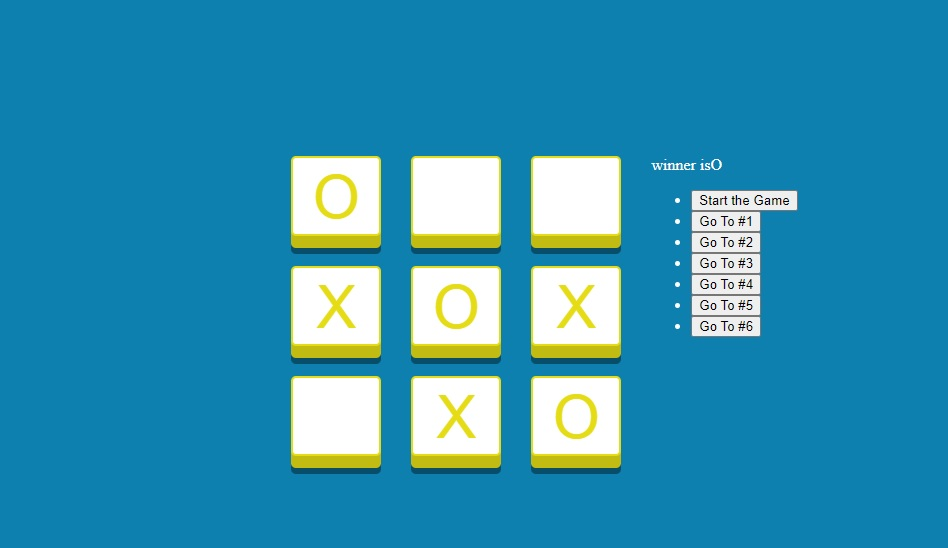
</h1>

#### Tic Tac Toe

- [x] 1. Create Game UI
- [x] 2. Add Reducer
- [x] 3. Add Button Click
- [x] 4. Create Move History Buttons
- [x] 5. Add Jump Click Handler
- [x] 6. Calculate Winner
- [x] 7. Deploy on Github Pages 

#### Aperfeiçoamento

- [ ] Melhorar o design da tela
- [ ] favicon
- [ ] responsive: web e mobile
- [ ] hospedar

#### Telas 

    

### o Projeto  

#### Rodar o Projeto Frontend  

`npx create-react-app tic-tac-toe` 
`cd tic-tac-toe` 
`npm start`   

#### Hospedar no Github Pages 

- [ ] `npm install gh-pages`
- [ ] configuração do package.json
- [ ] `npm run deploy`

### Referências

[Build Tic Tac Toe Game By React.js [Reducer Hook Tutorial] ](https://www.udemy.com/course/reactjs-tic-tac-toe-game-in-30-minutes/)  
Por Bassir Jafarzadeh

<h4 align="center"> 
	🚧 Interval Number 🚀
</h4>   

 
  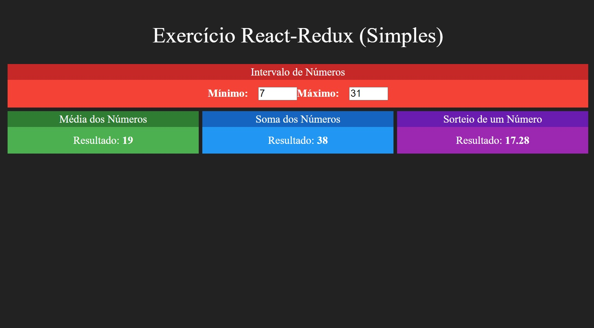  

 

## 🚀 Projeto

Introdução do redux para gerenciamento de estados.

## 💻 Tecnologias

- [x] 1. Html, css, javascript
- [x] 2. ReactJs, Redux

#### Aperfeiçoamento

- [ ] revisar o redux

## 🚀 Inicializar o projeto 

Create the app in the development mode: `npx create-react-app react-redux`:  

Runs the app in the development mode: `npm start`:  
Open [http://localhost:3000](http://localhost:3000) to view it in the browser. 

## 📝 Licença

Este projeto esta sobe a licença MIT.

Feito com ❤️ por Douglas A B Novato 👋🏽 [Entre em contato!](https://www.linkedin.com/in/douglasabnovato/)
 
Fonte do projeto Por Leonardo Moura Leitão no [Curso React + Redux: Fundamentos e 2 Apps do Absoluto ZERO!](https://www.udemy.com/course/react-redux-pt/), [Cod3r](https://www.cod3r.com.br/), [Github Cod3r](https://github.com/cod3rcursos/curso-react-redux)

<h4 align="center"> 
	🚧 React Hooks Handbook 🚀
</h4>

  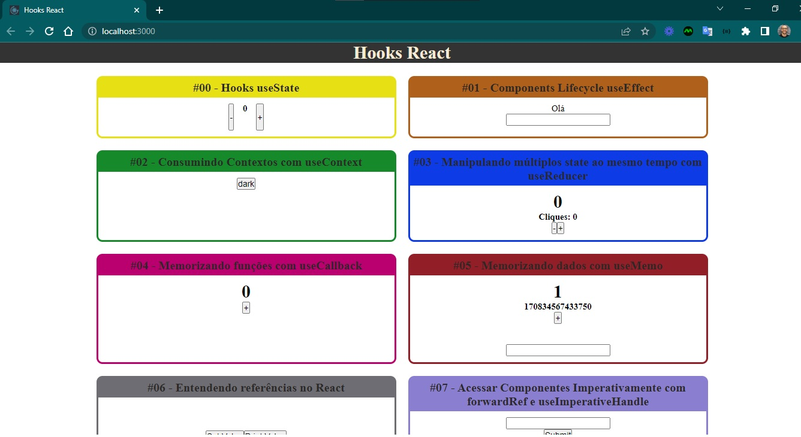

 

## Sobre o projeto

- Criado um layout para expor na prática o conteúdo teórico de Hooks.

### Hooks React

- [x] useState #00: inicialização de estado
- [x] useEffect #01: está executando duas vezes. :. é como as coisas funcionam agora no React, a única maneira de desabilitar esse comportamento é desabilitar o modo estrito. Em create-react-app você pode ir no seu arquivo index.js e remover o componente de ordem superior StrictMode.
- [x] useContext #02: consumir contextos 
- [x] useReducer #03: manipular múltiplos state ao mesmo tempo 
- [x] useCallback #04: memorizando funções 
- [x] useMemo #05: memorizando dados 
- [x] useRef #06: entender referências 
- [x] forwardRef e useImperativeHandle #07: acessar componentes imperativamente 
- [x] useLayoutEffect #08: diferenças entre useEffect e useLayoutEffect 
- [x] useCustom #09: criar custom hook, criei o useFetch  
- [x] useDebugValue #10: para que serve esse hook

### Warnings

- [Por que o useEffect é executado duas vezes](https://josiaspereira.com.br/por-que-o-useeffect-e-executado-duas-vezes/)
- [posicionamento do header](https://www.w3schools.com/howto/howto_css_fixed_menu.asp)
- [posicionamento do footer](https://www.w3schools.com/howto/howto_css_fixed_footer.asp)

### Referências

Conteúdo do Mateus Silva
- [Instagram](https://www.instagram.com/imateus.silva/)

- [e-book React Hooks](https://devacademy.com.br/ebooks/react-hooks/)

  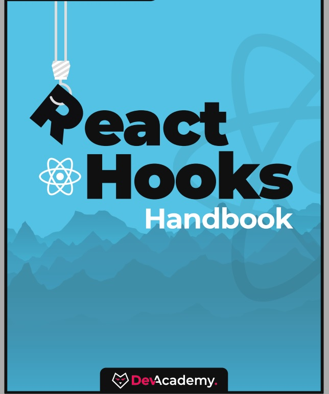

- [playlist React Hooks](https://www.youtube.com/playlist?list=PLPXWI3llyMiLayGs4_noY8Q1-rbmbFoYM)

  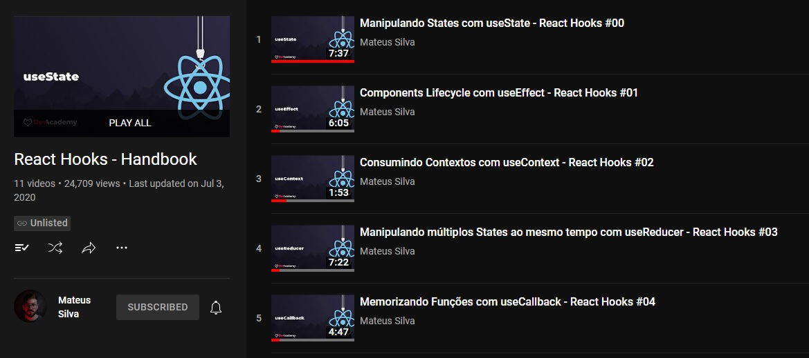

<h4 align="center"> 
	🚧 React Hooks 🚀
</h4>   

 
   
   

 

## 🎨 Projeto

- Criado um layout para demonstrar os fundamentos do react hooks na prática.

## 💻 Tarefas

- [x] 1. Introdução do Módulo
- [x] 2. Configuração de Projeto: `npm i -g create-react-app` e `create-react-app react-hooks` 
- [x] 3. useState #01
- [x] 4. useEffect #02
- [x] 5. useRef #03
- [x] 6. useMemo #04
- [x] 7. useCallback #05 
- [x] 8. porque usar context API
- [x] 9. useContext #06
- [x] 10. useReducer #07
- [x] 11. Custom Hooks #08
- [x] 12. Conclusão do Módulo

## 🚀 Seções 

- [x] Layout e lógica [60 - 81] 

## 🚀 Construído o projeto 

- favicon hooks
- título da página
- idioma da página
- fonts google roboto via link
- componente funcional em react com [hooks](https://reactjs.org/docs/hooks-intro.html)

#### Aperfeiçoamento

- [ ] revisar o useContext e sua pasta store
 
## 📝 Licença

Este projeto esta sobe a licença MIT.

Feito com ❤️ por Douglas A B Novato 👋🏽 [Entre em contato!](https://www.linkedin.com/in/douglasabnovato/)
 
Fonte do projeto Por Leonardo Moura Leitão no [Curso React + Redux: Fundamentos e 2 Apps do Absoluto ZERO!](https://www.udemy.com/course/react-redux-pt/), [Cod3r](https://www.cod3r.com.br/), [Github Cod3r](https://github.com/cod3rcursos/curso-react-redux)

<h4 align="center"> 
	🚧 React Fundamentos 🚀
</h4>  

 
  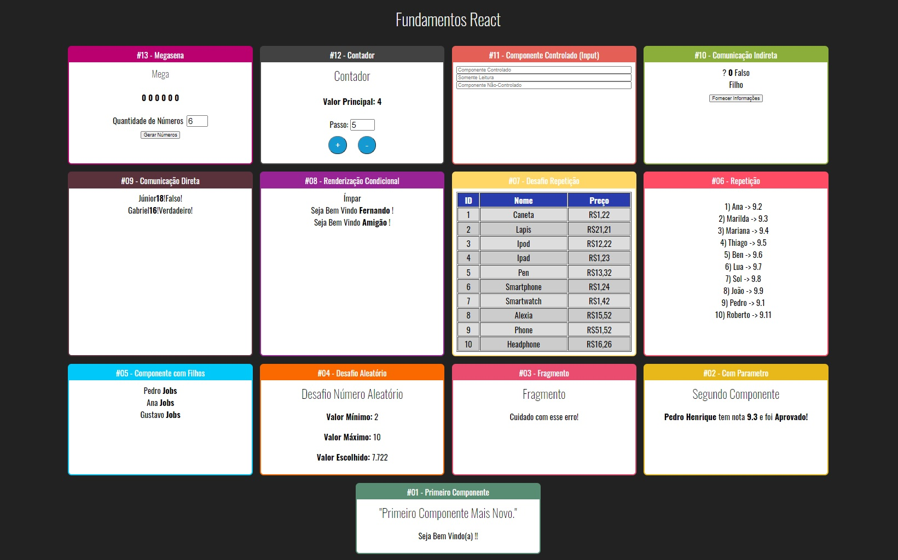 

 

## 🎨 Projeto

- Criado um layout para demonstrar os fundamentos do react na prática. 

## 💻 Tarefas 

- [x] 1. Primeiro Componente: basicos/Primeiro.jsx
- [x] 2. Com Parâmetros: basicos/ComParametro.jsx
- [x] 3. Fragmento: basicos/Fragmento.jsx
- [x] 4. Desafio Aleatório: basicos/Aleatório.jsx
- [x] 5. Card, um componente template: layout/Card.jsx
- [x] 6. Componente com filhos: basicos/Familia.jsx e basicos/FamiliaMembro.jsx
- [x] 7. Repetição: repeticao/ListaAlunos.jsx e data/alunos.js
- [x] 8. Desafio de Repetição: repeticao/TabelaProdutos.jsx e data/produtos.js
- [x] 9. Renderização Condicional com operador ternário: condicional/ParOuImpar.jsx
- [x] 10. Renderização Condicional com componente funcional: condicional/If.js e condicional/UsuarioInfo.jsx
- [x] 11. Comunicação Direta: comunicacao/DiretaFilho.jsx e comunicacao/DiretaPai.jsx
- [x] 12. Comunicação Indireta: comunicacao/IndiretaFilho.jsx e comunicacao/IndiretaPai.jsx, utiliza estado
- [x] 13. Componente Controlado: formulario/Input.jsx
- [x] 14. Contador, um componente baseado em classe: contador/Contador.jsx, contador/Botoes.jsx, contador/Display.jsx, contador/PassoForm.jsx

## 🚀 Seções 

- [x] 1. Introdução [1 - 8]  
- [x] 2. Fundamentos React [9 - 42] 

## 🚀 Desafio Final

- [x] 15. Megasena

## 🚧 Warnings (identificar, pesquisar, programar e testar)

- Eslint, array function: `Assign arrow function to a variable before exporting as module default Eslint`: pede para nomear a função
 
## 📝 Licença

Este projeto esta sobe a licença MIT.

Feito com ❤️ por Douglas A B Novato 👋🏽 [Entre em contato!](https://www.linkedin.com/in/douglasabnovato/)
 
Fonte do projeto Por Leonardo Moura Leitão no [Curso React + Redux: Fundamentos e 2 Apps do Absoluto ZERO!](https://www.udemy.com/course/react-redux-pt/), [Cod3r](https://www.cod3r.com.br/), [Github Cod3r](https://github.com/cod3rcursos/curso-react-redux)

<h4 align="center"> 
	🚧 Voss Coder 🚀
</h4>

  

  

Uma aplicação com funcionalidades demonstrando pílulas de fundamentos em reactjs.

- Criado projeto com [Create React App](https://github.com/facebook/create-react-app).
- Inicializar projeto com `npm start`.
- aberto projeto na porta [http://localhost:3000](http://localhost:3000).
- [Create React App documentation](https://facebook.github.io/create-react-app/docs/getting-started).
- [React documentation](https://reactjs.org/).

## Planejamento

Vamos registrar a maneira como estamos fazendo as coisas nesse projeto.

### Procedimentos

- criar uma branch para desenvolver as tarefas do dia
- criar as issues das tarefas com descrição
- citar as referências consultadas
- abrir pull request para avaliar na branch main

## Branches

- main, developer-v1.0

### Referências da Documentação

- [x] [html color codes](https://htmlcolorcodes.com/)
- [x] [React Home](https://pt-br.reactjs.org/)
- [x] [React Instalação - Introdução](https://pt-br.reactjs.org/docs/getting-started.html)
- [x] [React Instalação - Adicionar o React a um site](https://pt-br.reactjs.org/docs/add-react-to-a-website.html)
- [x] [React Instalação - Crie um novo React App](https://pt-br.reactjs.org/docs/create-a-new-react-app.html)
- [x] [React Instalação - CDN Links](https://pt-br.reactjs.org/docs/cdn-links.html)
- [x] [React Instalação - Canais de Release](https://pt-br.reactjs.org/docs/release-channels.html)
- [x] [React Principais Conceitos - 1. Hello World](https://pt-br.reactjs.org/docs/hello-world.html)
- [x] [React Principais Conceitos - 2. Introduzindo JSX](https://pt-br.reactjs.org/docs/introducing-jsx.html)
- [x] [React Principais Conceitos - 3. Renderizando Elementos](https://pt-br.reactjs.org/docs/rendering-elements.html)
  - [x] [MDN - Uma reintrodução ao JavaScript](https://developer.mozilla.org/pt-BR/docs/Web/JavaScript/Language_Overview)
  - [x] [MDN - Javascript](https://developer.mozilla.org/pt-BR/docs/Web/JavaScript)
  - [x] [The Modern JavaScript Tutorial](https://javascript.info/)
  - [x] [React Tutorial: An Overview and Walkthrough](https://www.taniarascia.com/getting-started-with-react/)
  - [x] [React for Designers](https://reactfordesigners.com/)
  - [x] [Modern JavaScript in React Documentation](https://gist.github.com/gaearon/683e676101005de0add59e8bb345340c)
  - [x] [React, Rethinking best practices - Pete Hunt](https://www.youtube.com/watch?v=x7cQ3mrcKaY)
- [x] [React Principais Conceitos - 4. Componentes e Props](https://pt-br.reactjs.org/docs/components-and-props.html)
- [x] [React Principais Conceitos - 5. State e ciclo de vida](https://pt-br.reactjs.org/docs/state-and-lifecycle.html)
- [x] [React Principais Conceitos - 6. Manipulando eventos](https://pt-br.reactjs.org/docs/handling-events.html)
  - [x] [Styled Components](https://styled-components.com/)
- [x] [React Principais Conceitos - 7. Renderização condicional](https://pt-br.reactjs.org/docs/conditional-rendering.html)
- [x] [React Principais Conceitos - 8. Listas e Chaves](https://pt-br.reactjs.org/docs/lists-and-keys.html)
- [x] [React Principais Conceitos - 9. Formulários](https://pt-br.reactjs.org/docs/forms.html)
- [x] [React Principais Conceitos - 10. Elevar o State - muito importante](https://pt-br.reactjs.org/docs/lifting-state-up.html)
- [x] [React Principais Conceitos - 11. Composição vs Herança](https://pt-br.reactjs.org/docs/composition-vs-inheritance.html)
- [x] [React Principais Conceitos - 12. Pensando do jeito React](https://pt-br.reactjs.org/docs/thinking-in-react.html) 
  - [x] [React Router](https://www.w3schools.com/react/react_router.asp)
  - [x] [Nav Menu Estilizar](https://www.w3schools.com/howto/howto_js_topnav_responsive.asp)
- [ ] [React Guias Avançadas](https://pt-br.reactjs.org/docs/accessibility.html)
- [ ] [React Referência da API](https://pt-br.reactjs.org/docs/react-api.html)
- [ ] [React Hooks - muito importante](https://pt-br.reactjs.org/docs/hooks-intro.html)
- [ ] [React Testando](https://pt-br.reactjs.org/docs/testing.html)
- [ ] [React Como Contribuir](https://pt-br.reactjs.org/docs/how-to-contribute.html)
- [ ] [React FAQ](https://pt-br.reactjs.org/docs/faq-ajax.html)

### Tarefas da Documentação

- [x] 0. Estrutura da página com Card e ListItems
- [x] 0.1. Tornar uma página com rota de 0 a 17. Fazer o mesmo para os próximos 
- [x] 0.2. Estilizar os componentes com styled components
- [x] 0.3. Estilizar o menu de navegação das rotas
- [x] 1. Redes Sociais
- [x] 2. Cronômetro
- [x] 3. Todo List
- [x] 4. Plugins
- [x] 5. Like Buttons
- [x] 6. Toolchains
- [x] 7. Inicializar Projeto React
- [x] 8. Formatar Nome
- [x] 9. Clock
- [x] 10. Componentes e Props
- [x] 11. Toggle + Styled Components
- [x] 12. LoginControl: Variáveis de Elementos + Evitar renderização
- [x] 13. KeyLists
- [x] 14. FormControlled
- [x] 15. TemperatureCalculator - muito importante
- [x] 16. Message 
- [x] 17. MockUp - muito importante

### Dependências

- npm i remarkable
- npm i styled-components

### Versões

- versão 1: desktop - header, main.

  
  
  

- versão 1: mobile - header, main.

  
  
  

## Branches

- developer-v2.0

### Referências do Tutorial

- [ ] [React Tutorial](https://pt-br.reactjs.org/tutorial/tutorial.html)

### Tarefas do Tutorial

- [ ] 0. tarefa

### Versões

- versão 2: desktop - header, main.

  

- versão 2: mobile - header, main.

  

## Branches

- developer-v3.0

### Referências do Blog

- [ ] [React Blog](https://pt-br.reactjs.org/blog/2021/12/17/react-conf-2021-recap.html)

### Tarefas do Blog

- [ ] 0. tarefa

### Versões

- versão 3: desktop - header, main.

  

- versão 3: mobile - header, main.

  

## Branches

- developer-v4.0

### Referências do Comunidade

- [ ] [React Comunidade](https://pt-br.reactjs.org/community/support.html)

### Tarefas do Comunidade

- [ ] 0. tarefa

### Versões

- versão 4: desktop - header, main.

  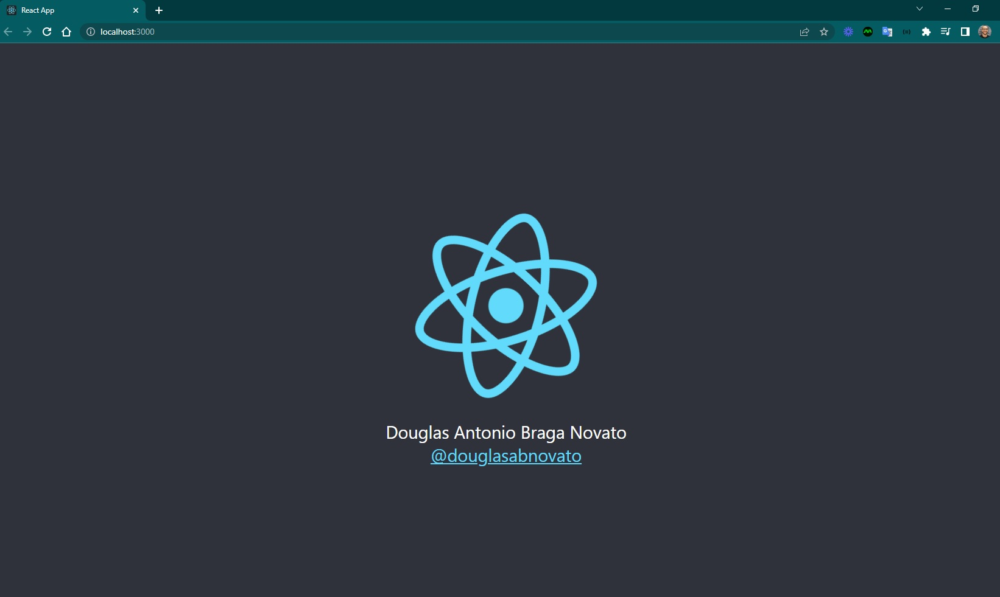
  
  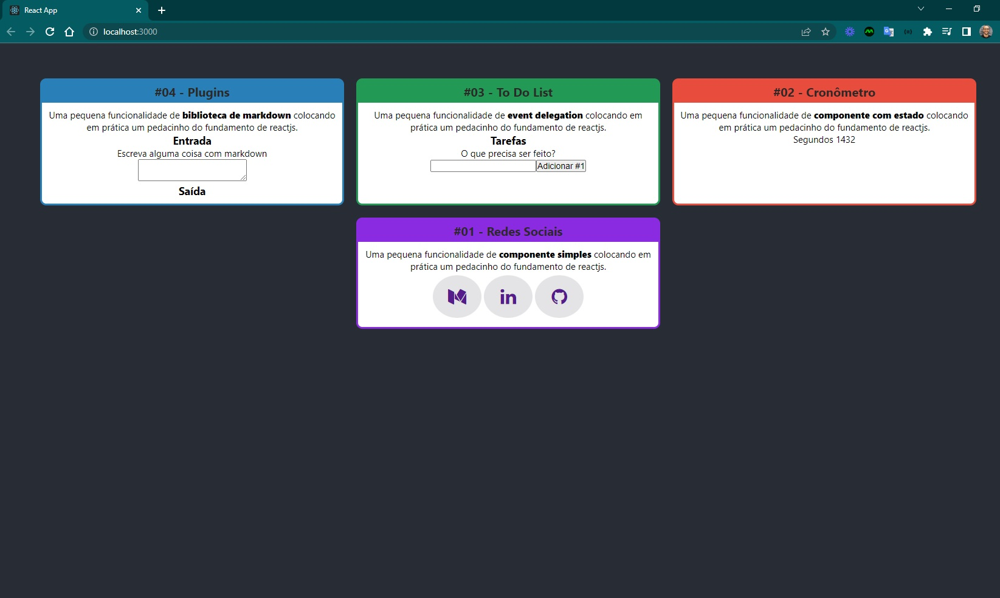
  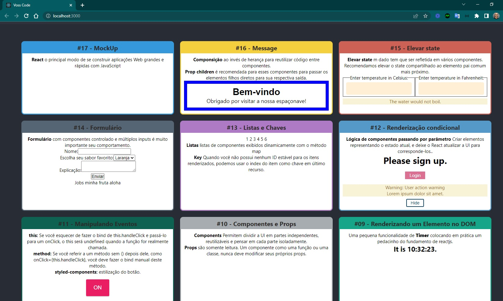

- versão 4: mobile - header, main.

  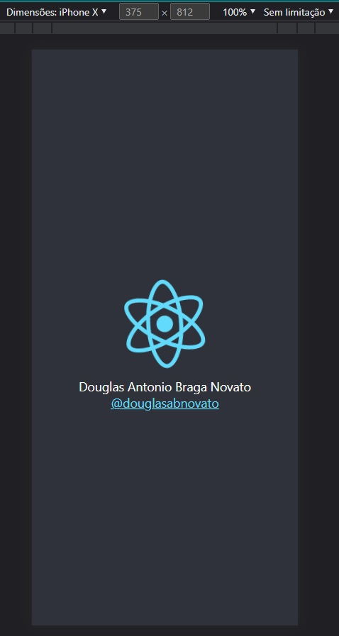
  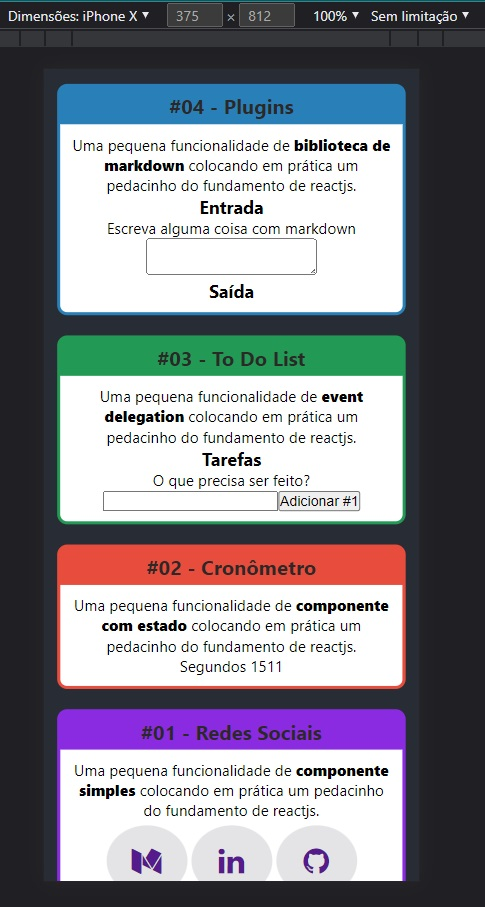
  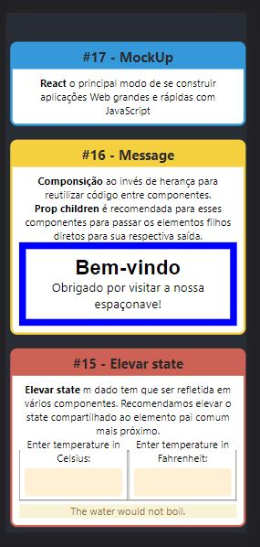

