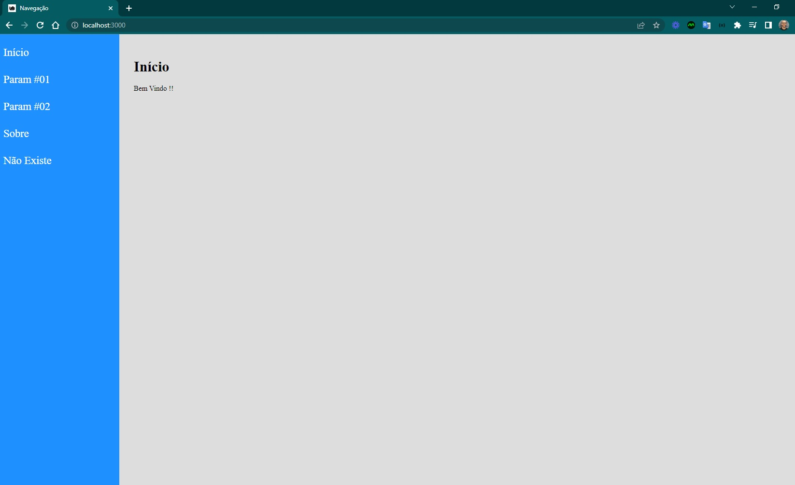

<h4 align="center"> 
	🚧 React Router 🚀
</h4>   

 
   

 

## 🎨 Projeto

- Criado um layout para demonstrar os fundamentos do react router na prática.

## 💻 Tarefas

- [x] 1. Instalação de dependências: `npm i -g create-react-app`
- [x] 2. Criação de Projeto: `npx create-react-app react-router` e `npm i react-router-dom`
- [x] 3. Estrutura de Projeto
- [x] 4. Aplicação de estilo
- [x] 5. Navegação simples
- [x] 6. Navegação com Parâmetro
- [x] 7. Parâmetro exact
- [x] 8. Página não encontrada
- [x] 9. Detalhes finais do módulo

## 🚀 Seções 

- [x] Layout e lógica [50 - 59] 

## 🚀 Construído o projeto 

- favicon navegação
- título da página
- idioma da página
- fonts google roboto via link
 
## 📝 Licença

Este projeto esta sobe a licença MIT.

Feito com ❤️ por Douglas A B Novato 👋🏽 [Entre em contato!](https://www.linkedin.com/in/douglasabnovato/)
 
Fonte do projeto Por Leonardo Moura Leitão no [Curso React + Redux: Fundamentos e 2 Apps do Absoluto ZERO!](https://www.udemy.com/course/react-redux-pt/)

